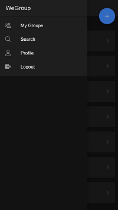
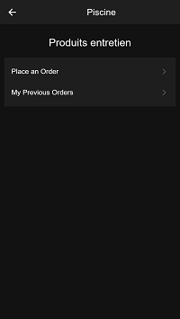
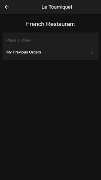
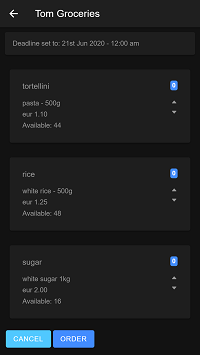
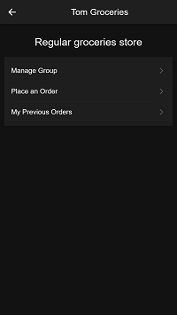
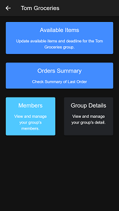
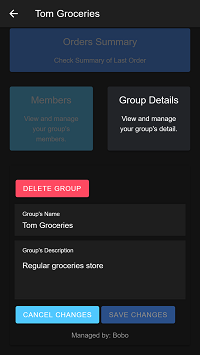
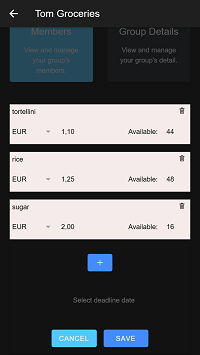
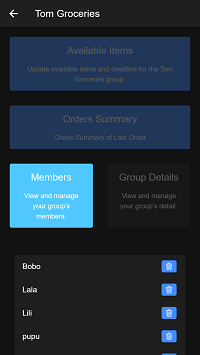
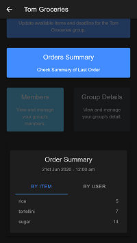

# WeGroup
CodeWorks Solo Project

WeGroup is an app allowing people to group their commodities orders. It has been inspired by the current Covid situation where people can not go out often and do their shopping easily.

To run the app, you must:
* clone the repo
* create a postgreSQL database
* create tables by running the dbSetup_readme.js file
* provide back-up info as detailed in the config-example.js file (server)
* provide your firebase info as detailed in the environment-example.js file (client)

## Stack

* Backend: Node.js with Koa framework
* Database: PostgreSQL
* Services: Google Firebase Authentication
* Client: Ionic Framework on top of Angular

## Demo

WeGroup app menu.

Commands available for a "regular" member of a group when placing an order is possible.

Commands available for a "regular" member of a group when placing an order is NOT possible.

When it is possible to place an order, the link routes to the "order" page:

Commands available for the "manager" member of a group.

The extra "Manage Group" command reaches the following "managing page":

Where the "Group Manager" can :

Check and Update the group general information:

Manage the available products:

Manage members of his/her group:

And have a recap of what to order to the supplier:

